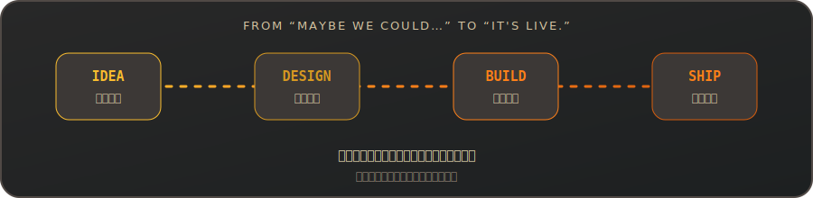
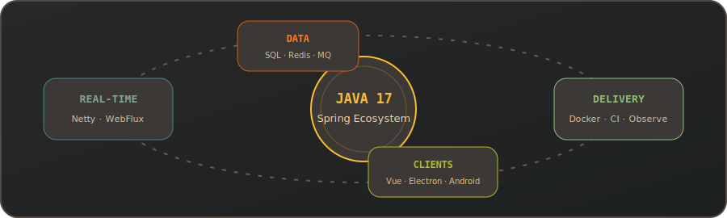
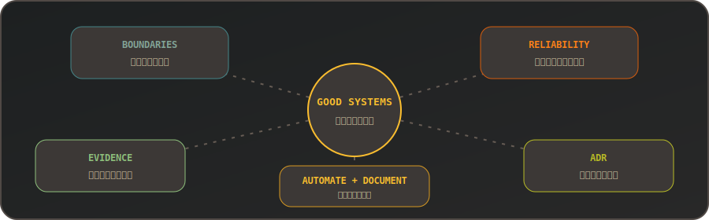

  

<h1>Tan Xiaomeng <code>@ZenSyntax</code></h1>

<strong>Java Backend Developer · Full-stack Independent Developer</strong>

两套分布式全栈系统，从架构设计一路做到前后端、部署、监控与技术文档。

  

## `~/overview`

以 Java 与 Spring 生态为主线，覆盖微服务拆分、实时通信、数据一致性、缓存与消息治理。需要打通交付链路时，也会进入 Vue、Docker、Jenkins 和可观测性系统，把最后一公里接上。

过去一年，独立完成了两个分布式全栈系统。从需求分析、数据库与系统架构设计，到前后端实现、基础设施编排、CI/CD、可观测性和技术文档，整条链路都亲手走过。比起“功能终于跑了”，我更喜欢“它上线了，而且以后还改得动、查得清”。

  

> 数字不是全部，但可以帮你快速了解我确实做过什么。源码行数按当前项目快照统计，包含注释与空行。两个核心项目因软件著作权申请及知识产权保护暂不开源，以下只展示经过脱敏的技术方案与工程成果。

## `~/toolbox`

徽章看起来很多，简单说就是：Java 和 Spring 是主场，分布式中间件是常客，Vue 与 DevOps 工具负责把想法真正送到用户面前。

  

<strong>展开完整技术栈清单</strong>

### Backend / Distributed Systems

  
  
  
  
  
  
  
  

### Data / Middleware

  
  
  
  
  
  
  
  
  
  

### Frontend / Multi-platform

  
  
  
  
  
  
  
  

### DevOps / Observability

  
  
  
  
  
  
  
  

  

### 我用这些工具做什么

- **比较顺手：** Java、Spring 生态、微服务拆分、分布式事务、缓存治理、并发控制、可靠消息、限流熔断、数据库设计与 SQL 优化。
- **也能接上：** Vue 3 全栈开发、Docker Compose 基础设施编排、Jenkins 自动化部署，以及日志、指标、链路追踪一体化建设。
- **最近在折腾：** Coze Agent 工作流与 Vibe Coding 实践。
- **下一块拼图：** JVM 深度调优与大规模线上生产环境故障治理。

## `~/deployed-systems`

  

### `01 / EasyChat` — 企业级分布式即时通信系统

> **私有项目 · 完全独立开发 · 2 项软件著作权申请 · 前后端约 10.5 万行源码**

EasyChat 最初只是一个“做套真正好用的聊天系统”的想法，后来一路长成了完整的分布式即时通信系统。它采用“群组 + 频道”的二级组织模型，配合 RBAC 自定义角色、好友/群组标签和动态 Feed，提供更接近现代社区平台的即时通信体验。

  

<strong>展开技术实现</strong>

- **微服务架构：** Spring Boot 3、Spring Cloud Alibaba 与 Java 17；后端 Monorepo 包含 15 个服务模块和 7 个可复用框架模块。
- **实时通信：** 将 WebFlux + Netty 长连接接入层与 Servlet 业务层物理拆分，通过 RabbitMQ 削峰解耦，避免 I/O 线程被阻塞业务拖慢。
- **多设备端到端加密：** 使用 AES 消息密文、设备级非对称加密头与 Sender Key 版本分发，覆盖私聊、频道消息、自身多端同步和缺失密钥退避恢复。
- **可靠性与一致性：** 自研声明式分布式锁、幂等、令牌桶限流、分数索引排序组件；以本地消息表 + RabbitMQ + XXL-Job 补偿保障最终一致性。
- **高实时数据处理：** Redis 路由表维护长连接节点；动态 Feed 使用 Redis ZSet 热数据、游标分页、推拉结合与读时权限校验。
- **多端客户端：** Vue 3 + TypeScript 单套核心代码覆盖 Web、Electron 桌面端与 Capacitor Android 端。
- **安全体系：** 双 Token 无感刷新、SSO、敏感字段 AES 落库加密、慢哈希密码、OSS 预签名直传、网关鉴权与 IP 风控。
- **CI/CD：** 为基础设施、后端和前端分别建立 Jenkins Pipeline，完成远程 Docker 构建、重试部署与部署后校验。
- **可观测性：** SkyWalking + Prometheus + Grafana + Loki + Alloy + Alertmanager + Exporters，覆盖链路、指标、日志与告警。
- **知识资产：** 采用 SSOT 分层文档体系，持续维护需求、架构、开发规范、数据库、ADR、运维和测试资料，共沉淀 200 余份文档与图表。

`Java 17` `Spring Cloud Alibaba` `WebFlux` `Netty` `PostgreSQL` `Redis` `RabbitMQ` `Docker` `Jenkins` `Vue 3` `TypeScript`

### `02 / ContractGuard` — AI 合同审查系统

> **私有项目 · 完全独立开发 · 2 项软件著作权申请 · 前后端约 4 万行源码**

ContractGuard 来自一个很具体的问题：合同想交给 AI 审查，又不希望原文离开本地。围绕这个矛盾，我做了一套隐私优先的 AI 合同审查系统，串起 Word 解析、分级脱敏、人工确认、异步 AI 审查、风险定位、批注合并和结果导出的完整闭环。

  

<strong>展开技术实现</strong>

- **隐私优先：** 原始 Word 仅保存在浏览器本地；前端完成解析、预脱敏和人工确认，后端只接收确认后的脱敏文本。
- **本地计算：** 通过 Pyodide、Web Worker、IndexedDB 与自研规则引擎处理敏感词、隐私正则和用户规则，避免主线程阻塞并保留可复现快照。
- **AI 审查：** 使用 Spring AI 调用大模型并约束结构化输出；AI 调用脱离数据库事务执行，降低长事务占用连接的风险。
- **精确批注：** 以 `blockId + 字符偏移 + 前后文 + 出现次序` 进行结果定位，支持评论、删除、替换、前插和后插，并将批注合并回本地 Word 副本。
- **异步任务：** 通过任务抢占避免重复消费，结合 RabbitMQ、可靠消息发件箱、幂等消费和异常重试推进审查任务。
- **分层架构：** 后端采用 Controller、Service、Repository、DAO、Mapper 五层职责划分，包含 5 个业务模块和 17 个通用框架模块。
- **服务治理：** 集成 Nacos、Sentinel、Seata、Redis/Redisson、RabbitMQ 和 XXL-Job，处理配置、流控、事务、缓存与异步任务。
- **基础设施：** 通过 Docker Compose 编排 PostgreSQL、Redis、Nacos、Seata、Sentinel、RabbitMQ 与 XXL-Job 等 8 个服务容器。

`Spring AI` `Spring Cloud Alibaba` `PostgreSQL` `Redis` `RabbitMQ` `Pyodide` `IndexedDB` `Vue 3` `TypeScript` `Docker Compose`

## `~/things-i-care-about`

写代码久了，我越来越在意这些不太显眼、却决定项目能走多远的事情：

  

<strong>展开文字版工程原则</strong>

1. 先把问题问清楚，再选架构，不为“看起来高级”多绕路。
2. 一致性、幂等、重试、降级和可观测性，本来就是主流程的一部分。
3. 重要的选择写进 ADR，给未来的自己留一张“当时为什么”的纸条。
4. 能自动化的就少手搓，值得交接的就认真写文档。
5. 做过的拿证据说话，没做过的坦然放进学习清单。

## `~/right-now`

ContractGuard 刚完成一轮完整交付。接下来继续补强 JVM 与生产故障治理，同时探索 Agent 工作流如何进入真实业务，而不只是停留在演示里。

  

## `~/github-telemetry`

> 核心项目当前为私有仓库，因此下方统计和语言分布只反映 GitHub 可见活动，不代表我的完整技术投入。

  
  

  

<strong>展开贡献图与 GitHub 成就</strong>

  

  

  

## `~/off-duty`

我也不是一直在看日志。离开 IDE 后，通常会把时间交给射箭、国学、魔方和两部会反复重看的剧。

  

  

<strong>招聘联系</strong>

联系方式仅用于明确的招聘沟通。如果你是 HR 或招聘方，并且认为经历与岗位匹配，请在联系时说明**公司或团队、岗位名称、工作地点和用工形式**。

| 渠道 | 地址 | 备注 |
| --- | --- | --- |
| Email | [moreantx@gmail.com](mailto:moreantx@gmail.com) | 建议附完整岗位信息 |
| WeChat | `tianming23848` | 添加时请备注“公司 + 岗位” |

仅发送“你好”“在吗”或没有说明来意的好友申请，可能不会通过或回复。

