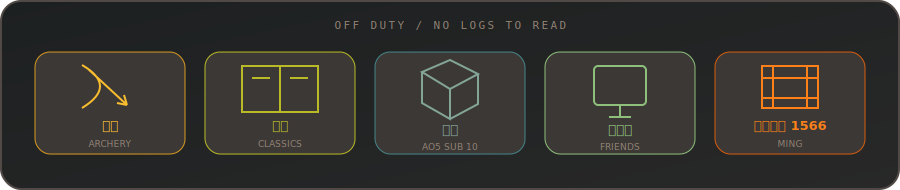

# XiaomengTan

Java developer, system architect, independent builder.

Building distributed systems and AI-powered products that occasionally behave as designed.

  

Currently working on:

- **EasyChat** — distributed instant messaging
- **ContractGuard** — privacy-first AI contract review

`Java` `Spring` `PostgreSQL` `Redis` `RabbitMQ` `Docker`

  

EOF
